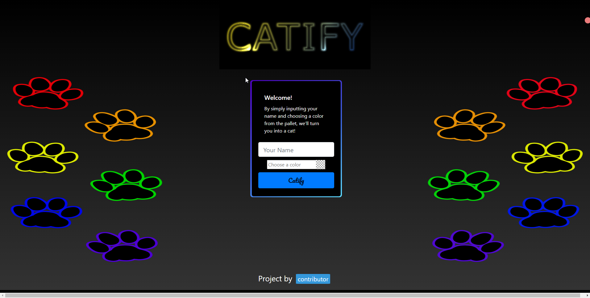

# Catify
By William, Mariam, Tarek & Dong 

## Description

Catify is a tool designed to convert a user’s profile into a cat. It works by prompting the user to input their name and theme color of choice. Catify then uses various API’s to provide the user with a compatible cat breed, age in cat years, gender and country of origin. The motivation behind this project was to build a fun interactive game that leverages various APIs.

The tech stack consists of bootstrap HTML to create two separate pages. The first page uses two input forms, username and color. Then, the data is fed to an object that calls four different APIs. The output data is then stored into an object which populates the result, a user generated card. In addition, as the user plays additional times, the data saves to local storage and creates “saved cards” dynamically at the bottom of the page using JQuery. Lastly, we used additional technologies called Swiper and Coloris to enhance the user interface.

   

## Installation 
This code does not require any installation. The HTMLs, JavaScrip files, CSS and images are provided. You can simply click the URL for the finished product.

## Usage 
Catify is very simple and straight forward to use, as shown in the screenshot. The user will enter their name and preferred theme color and click submit. The user will be redirected to a second page and displayed the main card or the finished output. The user will have the option to play again by clicking the the "Home" link on the left top of the page. There they can input thier friends or family's names to turn them into a cat!

The following code base was uploaded to a URL using GitHub for your convivence. The following URL is:

https://wlk-dev.github.io/catify/

In addition, we included screenshot below: 

## Credits 

[Gender API](https://genderize.io/?ref=apilist.fun)

[Age API](https://agify.io/)

[Nationality API](https://nationalize.io/)

[Cat API](https://thecatapi.com/)

[Flag API](https://flagpedia.net/download/api)

## License 

MIT License

Copyright (c) 2022 will

Permission is hereby granted, free of charge, to any person obtaining a copy
of this software and associated documentation files (the "Software"), to deal
in the Software without restriction, including without limitation the rights
to use, copy, modify, merge, publish, distribute, sublicense, and/or sell
copies of the Software, and to permit persons to whom the Software is
furnished to do so, subject to the following conditions:

The above copyright notice and this permission notice shall be included in all
copies or substantial portions of the Software.

THE SOFTWARE IS PROVIDED "AS IS", WITHOUT WARRANTY OF ANY KIND, EXPRESS OR
IMPLIED, INCLUDING BUT NOT LIMITED TO THE WARRANTIES OF MERCHANTABILITY,
FITNESS FOR A PARTICULAR PURPOSE AND NONINFRINGEMENT. IN NO EVENT SHALL THE
AUTHORS OR COPYRIGHT HOLDERS BE LIABLE FOR ANY CLAIM, DAMAGES OR OTHER
LIABILITY, WHETHER IN AN ACTION OF CONTRACT, TORT OR OTHERWISE, ARISING FROM,
OUT OF OR IN CONNECTION WITH THE SOFTWARE OR THE USE OR OTHER DEALINGS IN THE
SOFTWARE.

